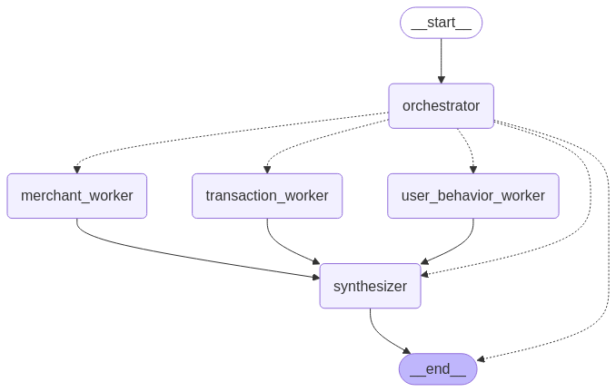

## 의심거래 보고서 작성 Agent


### Merchant Worker
- 가맹점의 의심 정황이 있는지 판단
- 대외 가맹점 평판 서비스 이용 (MOCK_DATA["merchant_risk"])

### Behavior Worker
- 유저 행동 패턴과 비교하여 의심 정황이 있는지 판단
- 유저 서비스(MOCK_DATA["users"]), 최근 거래 이력(MOCK_DATA["transactions"]) 서비스 이용

### Transaction Worker
- 거래 자체에 대한 의심 정황 판단
- 거래 시간, 거래 위치, 거래점 유형 등

## 합성(Synthesize) 및 판단(Decision)
- 주어진 데이터를 바탕으로 최종 판단

- 결과 예시
```bash
위험 거래 최종 분석 보고서
-------------------------------
거래 ID: TX12345678

위험 거래 판단: 매우 높음 (위험도 90점)

종합 판단 근거:
1. 다중 분석 결과 모두 "HIGH" 위험 수준 일치
2. 세부 위험 요인들:
- 심야 시간대(오후 10시 15분) 현금서비스 거래
- 비정상적인 위치 및 기기 ID
- 고위험 가맹점(퀵캐시ATM, 리스크 점수 78)
- 사용자의 일반적인 행동 패턴과 불일치
- 거래 금액(4,800 KRW) 대비 비정형적 특성

신뢰도 점수: 95점

권고 사항:
- 즉시 거래 중단
- 사용자 계정 일시 정지
- 추가 검증 필요
- 사기 가능성에 대한 심층 조사

결론: 매우 높은 위험 거래로 판단됨
```